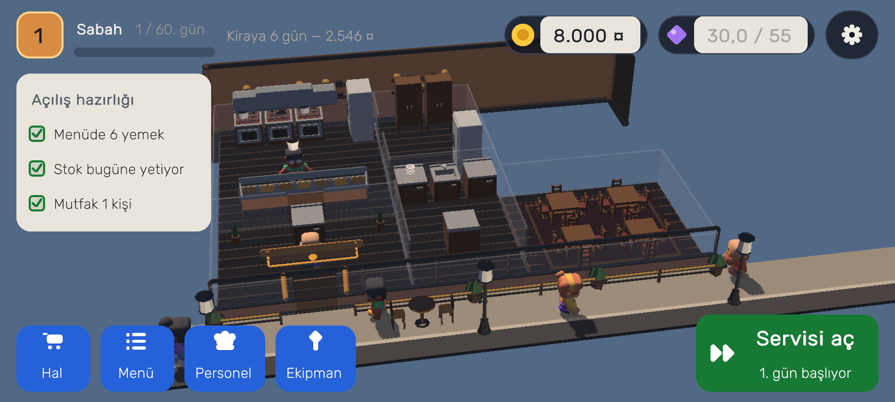
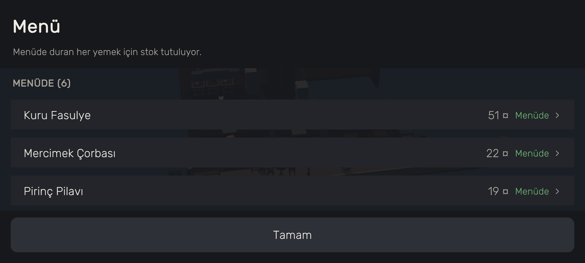
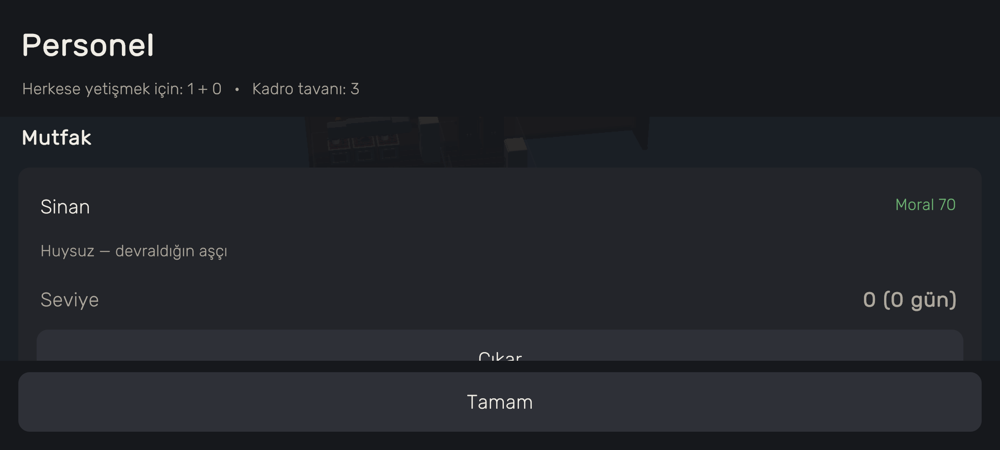
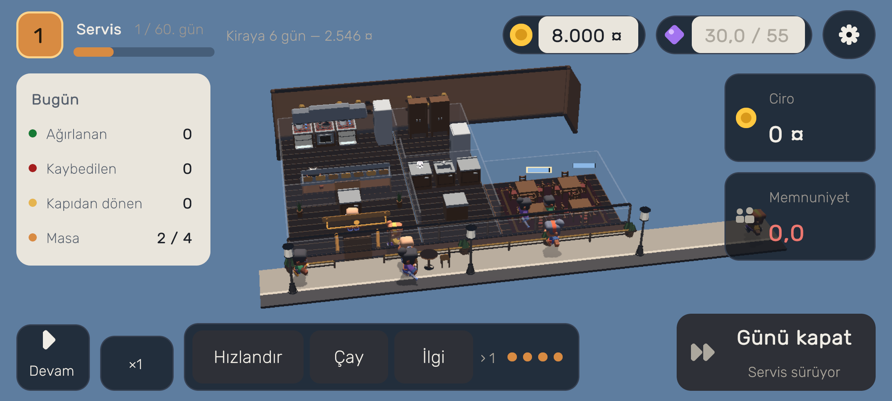
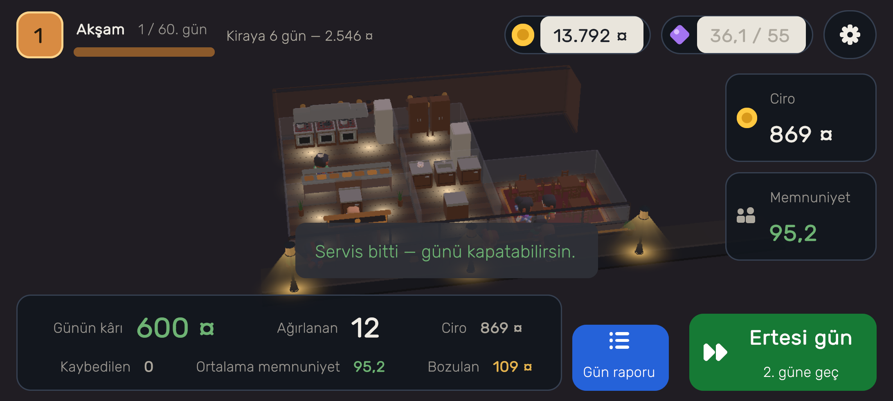
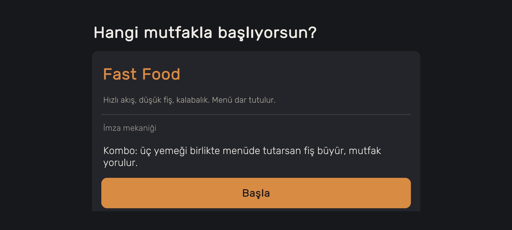
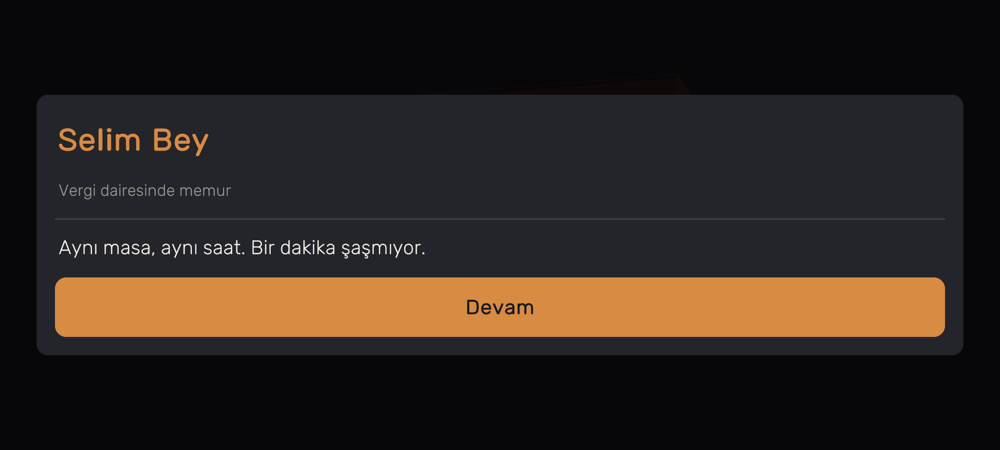
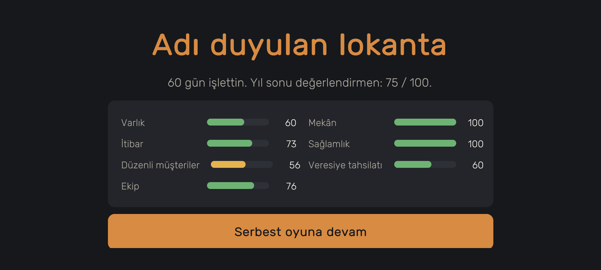

# Lokanta

**Patronsun, aşçı değil.** Devraldığın dört masalık bir lokanta, huysuz bir
aşçı ve altmış gün var.

2.5D low-poly, yatay, Android hedefli bir lokanta yönetim oyunu. Unity 6 + URP,
tek kişilik geliştirme.

*Kırkıncı gün: on dört masa, yedisi dolu, memnuniyet 92,7.*

---

## Ne oynuyorsun

Sen mutfakta değilsin. Senin işin menüyü kurmak, halden malzeme almak, kimi işe
alacağına karar vermek ve servis kızıştığında doğru masaya yetişmek. Yemekleri
aşçın yapıyor — iyi ya da kötü, tuttuğun kişiye göre.

Gün üç aşamalı ve her aşama ayrı bir karar istiyor.

### Sabah — kararlar

*Açılış hazırlığı: menü, stok ve mutfak üç satırda.*

**Hal.** Her malzemenin bugünkü fiyatı yıl ortalamasına göre gösteriliyor, raf
ömrüyle birlikte. Ucuz bir gün, saklayabiliyorsan fırsat; saklayamıyorsan
yalnızca bir gider oynaması. Kaç günlük alacağını sen seçiyorsun ve tavanı
soğuk hava deponun kademesi belirliyor.

Malzeme kalitesi de burada: üç kademe, ucuzu %25'e kadar ucuz ama müşteriyi
memnun etmiyor.

**Menü.** Otuz iki yemek var ama hepsini açık tutamazsın: menüde duran her
yemek için stok tutuluyor ve akşam bozulan her şey çöpe gidiyor. Dar menü az
zayiat, geniş menü çok müşteri.

**Kadro.** Ücret her gün ödeniyor, zirve haftada iki gün. Tam kadro herkese
yetişir ama parayı yer; bir kişi eksik çalışmak kazandırır ve karşılığında
masadan kızgın kalkan müşteriler bırakır.

### Servis — sen buradasın

Gün bir zirve etrafında şekilleniyor: Türk lokantasında sert bir öğle
patlaması, fast food'da öğle ve akşam iki tepe. Zirve, kadronun günlük
toplamına göre kurulduğu anda ezici olur — kuyruk oluşur, sabır tükenir.

Sayılı müdahale hakkın var ve dükkân büyüdükçe artıyor:

- **Mutfağı hızlandır** — bir istasyondaki işleri öne al
- **Salona çay çıkar** — bekleyen herkesin sabrını uzat
- **Bir masayla kendin ilgilen** — o masa daha çabuk döner

Hepsi aynı keseden çıkıyor ve harcanmayan hak gece yanıyor.

### Akşam — hesap

*Günün kârı, ağırlanan, ciro — ve **bozulan**: oyunun en büyük görünmez gideri.*

Şeritte günün özeti var; **Gün raporu** ardında paranın nereye gittiği kalem
kalem duruyor: malzeme, çöpe giden, ücret, kira. Kim geldi, kim kırıldı.

Her yedi günde bir **karne** çıkıyor: yedi eksenin geçen haftaya göre farkı.
Bir de **nişanlar** — "Zirveyi eksik kadroyla geçtin", "Defter kapandı". Görev
değil: geriye dönük tanıma, o yüzden planınla asla çatışmıyor.

---

## İki mutfak, iki imza

Başlangıçta seçiyorsun ve kayıt boyunca kilitli.

| | Fast food | Türk lokantası |
|---|---|---|
| ritim | öğle + akşam, iki tepe | sert öğle zirvesi |
| fiş | düşük, hacim oyunu | yüksek, mahalle müşterisi |
| imza | **kombo** — ortalama fişi yükseltir, mutfağı yorar | **veresiye** — müdavime defterden yazarsın, tahsilat güvene bağlı |

---

## Müdavimler

Yirmi isimli müşterinin her birinin üç sahnelik hikâyesi var. Sık gelen ve
memnun ayrılan müşteri sahnelerini açıyor:

> *"Artık siparişini söylemiyor. Oturuyor, siz biliyorsunuz."*

---

## Altmışıncı gün

Yedi eksende puanlanıyorsun: varlık, itibar, müdavimler, ekip, mekân,
sağlamlık ve mutfağının imzası. Tek sayı değil yedi eksen, çünkü farklı oyun
tarzları farklı yollardan iyi sonuç alabilmeli — biri büyüyerek, bir başkası
küçük ama sevilen bir dükkân işleterek.

**Batmak oyunu bitirmez.** Kasa eksiye düşerse ekipman satılır, dükkân küçülür,
borç silinir — ama yıl sonu değerlendirmesinde izi kalır.

Altmışıncı günden sonra serbest oyun.

---

## Reklam yok, veri yok

Oyun içi satın alma ile güç satılmıyor. Hiçbir veri toplanmıyor — uygulama
**internet izni bile istemiyor**. Bu paketin içinden doğrulandı: izin listesi
boş, `INTERNET` yok, kodda ağ çağrısı yok.

Türkçe ve İngilizce.

---

## Kapağın altında

Geliştirenler için kısa bir tur.

**Katmanlar.** `Lokanta.Core` saf C#: Unity referansı yok, **kayan nokta yok**
(bütün durum tamsayı, `Fx` sabit noktalı aritmetik), determinist. Oyun aynı
tohumla her makinede aynı kampanyayı üretiyor. Platform işleri port arkasında.

**Denge aracı.** `src/Lokanta.Harness` yirmiden fazla bot stratejisini 24 tohum
× 60 gün koşturuyor ve tabloyu basıyor: pasif oyuncu, makul oyuncu, fiyat
kıran, kadrosu eksik çalışan, imza mekaniğini oynayan… Bir tasarım sorusunun
cevabı ölçülmeden "biliniyor" sayılmıyor.

**Otomatik tur.** `tools/unity/tur.ps1` oyunu **gerçek Windows yapısında**
kendi kendine gezdiriyor: menüden kampanya sonuna, 130'dan fazla kontrolle.
Arayüzü görmenin tek yolu bu — ve bu depodaki görsellerin hepsini o üretiyor.

**Denetim.** `tools/check.py` on üç denetimi tek komutta koşuyor: içerik
üretimi, denge kuralları, metin tablosu, lisans defteri, URP ayarları, çekirdek
testleri.

**İçerik üretiliyor.** `content/` altındaki her şey `tools/` içindeki
üreteçlerden çıkıyor — elle düzenlenmiyor. Denge sayıları bir modelden
çözülüyor, metin tablosu tek kaynaktan iki dile açılıyor.

### Tekrar eden ders

Bu depodaki yorumların çoğu aynı cümlenin etrafında dönüyor:

> **Koşmayan bir kontrol, geçen bir kontrolle dışarıdan aynı görünür.**

Yeşil bir tik yanlış şeyi ölçüyor olabilir. Bir koruma akıl yürütmeyle doğru
sayılamaz — kaldırıp kırıldığı görülmelidir. Ayrıntılı kayıt `docs/` altında.

---

## Durum

Oynanabilir ve baştan sona koşuyor. Yayın öncesi kalanlar `docs/21`'de.
