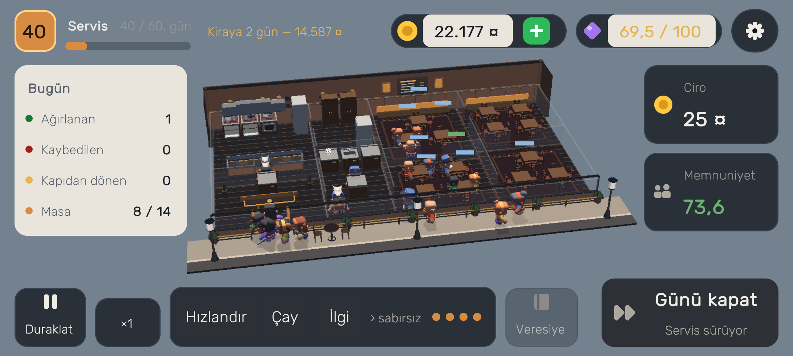
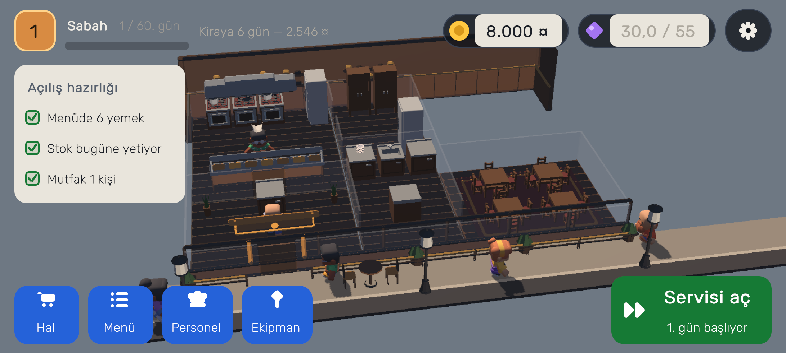
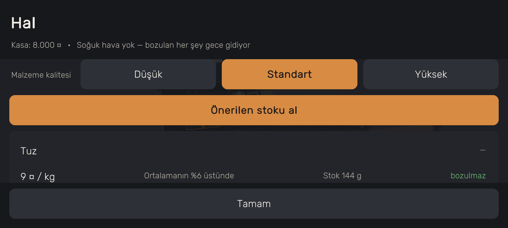
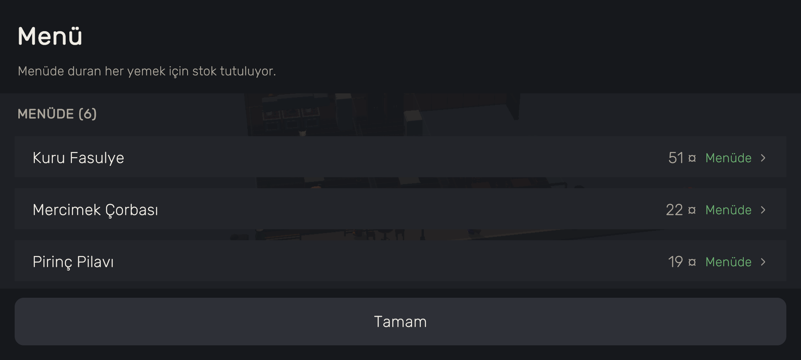
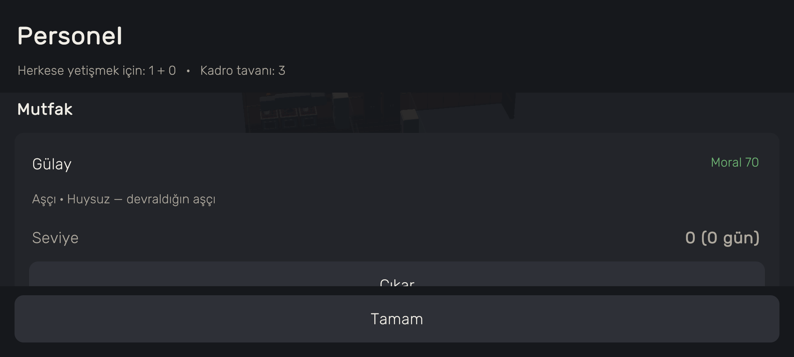
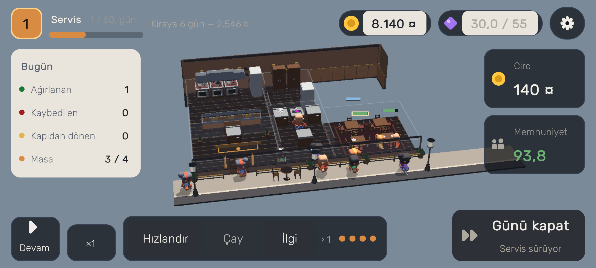
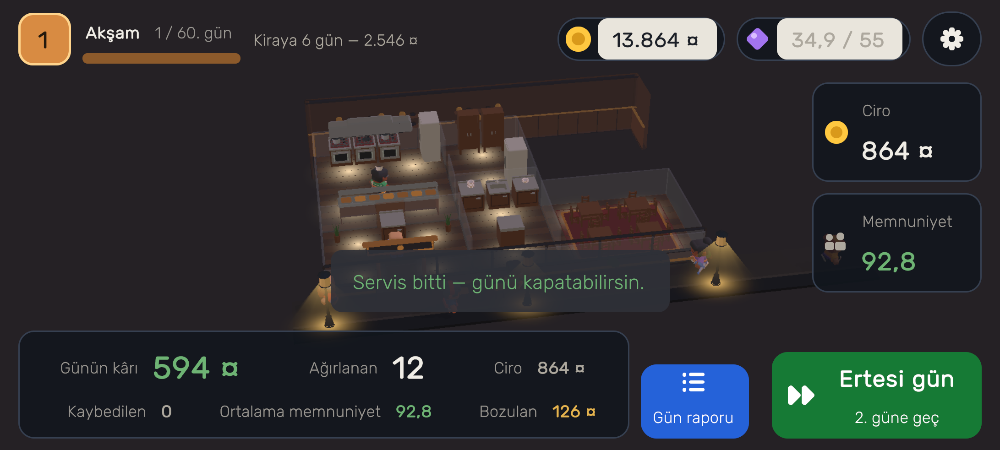
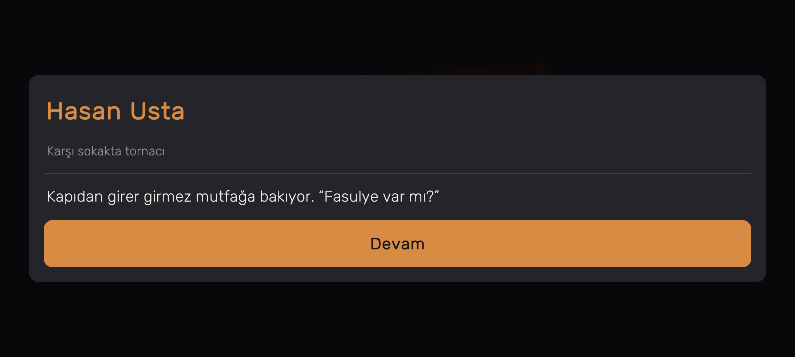
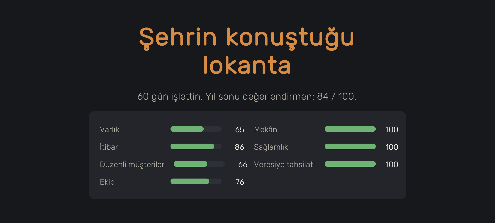

# Lokanta

**You're the owner, not the cook.** You inherit a four-table restaurant, a
bad-tempered cook and sixty days.

A 2.5D low-poly restaurant management game, landscape, Android first. Unity 6 +
URP, built by one person.



*Day forty, fast food: the lit menu board above the counter, the hot line in the
middle, tills at the ends — no waiter, the guest carries their own tray.*

---

## What you play

You are not in the kitchen. Your job is to set the menu, buy at the market,
decide who to hire, and get to the right table when service heats up. Your cook
does the cooking — well or badly, depending on who you hired.

The day has three phases and each one asks a different question.

### Morning — decisions



*Opening preparation: menu, stock and kitchen in three rows.*



**The market.** Today's price of every ingredient is shown against its yearly
average, together with its shelf life. A cheap day is an opportunity if you can
store it, and nothing but a wobble in your costs if you cannot. You choose how
many days to buy for, and your cold store's tier sets the ceiling.

Ingredient quality lives here too: three tiers, the cheap one up to 25% cheaper
and it does not leave the guest happy.



**The menu.** There are thirty-two dishes and you cannot keep them all open:
every dish on the menu ties up stock, and anything that spoils goes in the bin
tonight. A narrow menu wastes less; a wide one draws more.



**The crew.** Wages are paid every day, the peak comes two days a week. A full
crew serves everyone but eats the cash; running one short earns more, and pays
for it with guests who get up from the table angry.

### Service — this is where you are



The day is shaped around a peak: a hard lunch rush in the Turkish restaurant,
two smaller crests at lunch and dinner in fast food. The peak becomes crushing
the moment it is set against the crew's *daily* total — a queue forms and
patience runs out.

You get a limited number of interventions, and more as the place grows:

- **Rush the kitchen** — pull the jobs at one station forward
- **Send tea out to the room** — stretch the patience of everyone waiting
- **Attend a table yourself** — that table turns over faster

They all come out of one purse, and whatever you do not spend burns at midnight.

### Evening — the reckoning



*Today's profit, guests served, revenue — and **spoilage**, the game's largest
invisible cost.*

The strip carries the day's summary; behind **Day report** the money is itemised:
ingredients, what went in the bin, wages, rent. Who came, who was let down.

Every seventh day a **report card** appears: the seven axes against last week.
And **badges** — "You ran the peak short-handed", "The book is closed". Not
quests: recognition after the fact, which is why they never fight your plan.

---

## Two cuisines, two signatures


You choose at the start and it is locked for that save.

| | Fast food | Turkish restaurant |
|---|---|---|
| service | **self-service** — no waiter, a cleaner clears the tables | table service — the waiter takes the order, brings the food, settles the bill |
| rhythm | lunch + dinner, two crests | one hard lunch peak |
| ticket | low, a volume game (+30% guests) | high, neighbourhood trade |
| signature | **combo** — raises the average ticket, loads the kitchen | **the tab** — you write a regular into the book, and collecting depends on trust |
| room | dark tile, laminate tables, steel counter, lit menu board | timber panelling, kilim, copper band, warm light |

Self-service is not just a label: the guest carries their own tray and pays at
the counter, so half the hall work disappears. What it buys is a
crowd — and trays piling up on the tables.

---

## Regulars



Each of twenty named customers has a three-scene story. A customer who comes
often and leaves happy opens their scenes:

> *"Artık siparişini söylemiyor. Oturuyor, sen biliyorsun."*
>
> *("Doesn't order any more. He sits down; you know.")*

---

## Day sixty



You are scored on seven axes: wealth, reputation, regulars, crew, premises,
resilience and your cuisine's signature. Seven axes rather than one number,
because different ways of playing should be able to arrive at a good result by
different routes — one by growing, another by running a small, well-liked shop.

**Going broke does not end the game.** If the till goes negative, equipment is
sold, the shop shrinks, the debt is written off — but it leaves a mark on the
year-end review.

After day sixty, free play.

---

## No ads, no data

No power is sold through in-app purchases. No data at all is collected — the app
**does not even ask for internet permission**. This was verified from inside the
package: the permission list is empty, there is no `INTERNET`, and there is no
network call in the code.

**Five languages.** Turkish, English, Spanish, Chinese and Arabic — the game
opens in English by default and the language is changed in Settings. Chinese has
a second font; Arabic has letter joining and a mirrored layout
([docs/54](docs/54-five-languages.md)).

---

## Under the bonnet

A short tour for developers.

**Layers.** `Lokanta.Core` is pure C#: no Unity references, **no floating
point** (all state is integer, `Fx` fixed-point arithmetic), deterministic. The
same seed produces the same campaign on every machine. Platform work sits behind
a port.

**The balance tool.** `src/Lokanta.Harness` runs more than twenty bot strategies
over 24 seeds × 60 days and prints the table: the passive player, the reasonable
player, the price-cutter, the one who runs short-staffed, the one who plays the
signature mechanic… A design question is not counted as answered until it has
been measured.

**The automated tour.** `tools/unity/tour.ps1` makes the game play itself **in a
real Windows build**: from the menu to the end of the campaign, with more than
170 checks. It is the only way to see the interface — and it produces every
screenshot in this repository.

**Verification.** `python tools/check.py` runs the checks in one command:
content generation, balance rules, the string table, font coverage, store texts,
document links, the licence ledger, URP settings, whether the repository is
written in English, and the core tests.

**Content is generated.** Everything under `content/` comes out of the
generators in `tools/` — it is never hand-edited. The balance numbers are solved
from a model, and the string table opens from one source into five languages.

### What lives where

```
src/              The .NET side. NOTE: the core's SOURCE IS NOT HERE.
  Lokanta.Core/     A csproj that compiles unity/Assets/Lokanta/Core by link
  Lokanta.Content/  The same, for unity/Assets/Lokanta/Content
  Lokanta.Harness/  The balance tool: bot strategies x 60 days (real source)
tests/            The core's tests (245 of them)

unity/            The source of everything, plus view and platform.
  Assets/Lokanta/Core/     Simulation, economy, saves - no Unity, no float
  Assets/Lokanta/Content/  The content-reading layer (JSON -> objects)
  Assets/Lokanta/Game/     Interface, scene, the automated tour
  Assets/Lokanta/Editor/   Build, scene generation, checkers
  Assets/Lokanta/Art/      Models, textures, fonts, ATTRIBUTION.md
  Assets/Resources/        A copy of content/ - GENERATED, never touched by hand

content/          GENERATED content. Never hand-edited.
  loc/              tr, en, es, zh, ar - all five from one generator

tools/            The scripts that generate and verify everything.
  check.py          ONE COMMAND: runs everything below in order
  check_english.py  Is the repository written in English (CLAUDE.md rule 1)
  audit_content.py  The content-code contract: does the code read every field
  check_licenses.py Licences and the attribution ledger
  check_urp.py      The two copies of the URP settings must not diverge
  check_docs.py     Every document link resolves, every document is indexed
  dotnet_retry.py   For dotnet calls that Smart App Control blocks
  content/          Content generators (gen_*.py) and the store-text checker
    languages/        The five string tables - two files per language
  balance/          The balance model, solver and export
  art/              Model/texture generators, font coverage and subsetting
  unity/            PowerShell scripts that drive Unity in batch mode
  android/          Device and packaging work

docs/             A numbered log. Each number is the record of one piece of
                  work; the index is in docs/README.md.
vendor/           Third-party source files, with their licences
render/           Generated screenshots; the store images in render/store/
```

The rule: **one direction, once.** `src/` does not know Unity, `unity/` does not
balance the economy, `content/` is not written by hand, and nothing outside
`tools/` generates content.

### The lesson that keeps coming back

Most of the comments in this repository circle one sentence:

> **A check that does not run looks exactly like one that passes.**

A green tick may be measuring the wrong thing. A guard cannot be argued into
being correct — it has to be taken away and seen to break. The detailed record
is under `docs/`.

---

## Status

Playable and runs end to end. What remains before release is in
[docs/21](docs/21-business-and-release.md).
